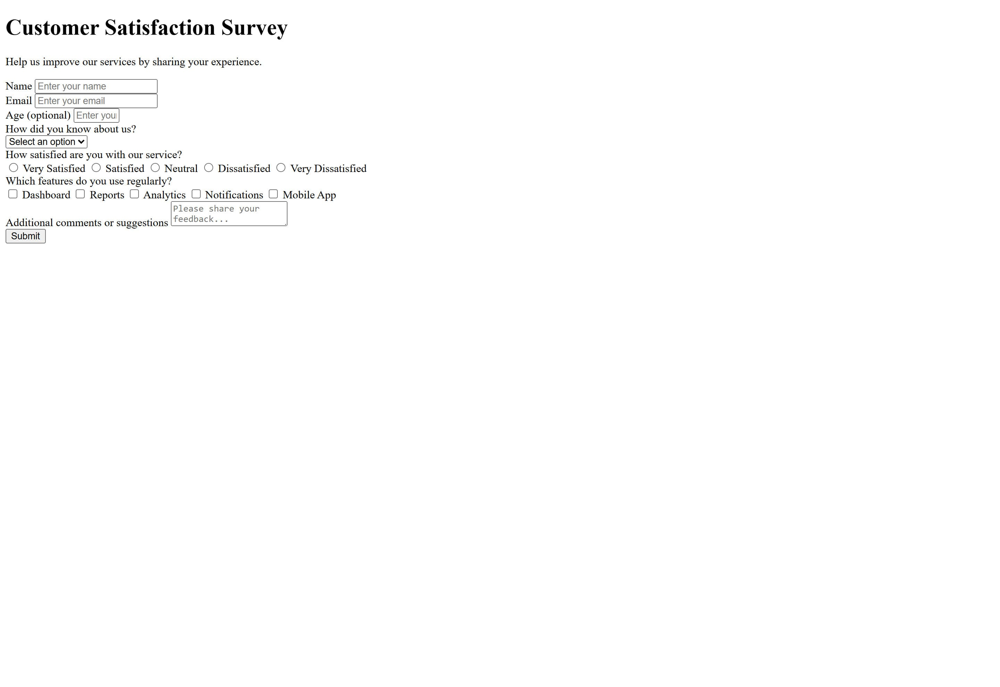

# Survey Form

## Preview



## Description

Customer satisfaction survey form built as part of the **["Survey Form"](https://www.freecodecamp.org/learn/responsive-web-design-v9/lab-survey-form/build-a-survey-form)** project in the **[Responsive Web Design Certification](https://www.freecodecamp.org/learn/responsive-web-design-v9/)** course on **[freeCodeCamp](https://www.freecodecamp.org/)**.

## Technologies Used

- HTML5
- Git & GitHub
- Command Line
- Visual Studio Code

## Project Structure

```
fcc-survey-form/
├─ README.md
├─ index.html
└─ preview.jpg
```

## Installation

1.  **Clone the repository**

    ```sh
    git clone https://github.com/yevgensrc/fcc-survey-form.git
    ```

2.  **Navigate to the project directory**
    ```sh
    cd fcc-survey-form
    ```

## Usage

Open the `index.html` file in your web browser. You can do this by double-clicking the file in your file explorer or by using your IDE's live server extension.

## Acknowledgments
- [freeCodeCamp](https://www.freecodecamp.org/) curriculum team

## Project Links

**[Live Preview](https://yevgensrc.github.io/fcc-survey-form/)** and **[Source](https://github.com/yevgensrc/fcc-survey-form)**.
